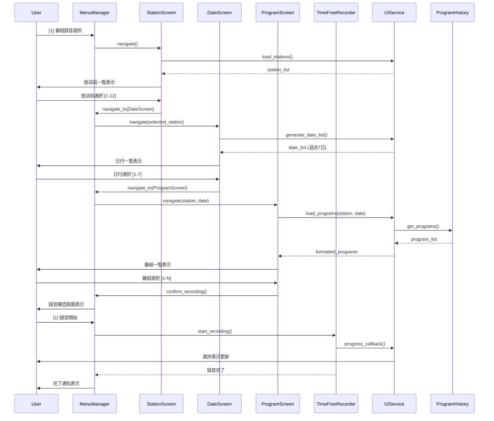
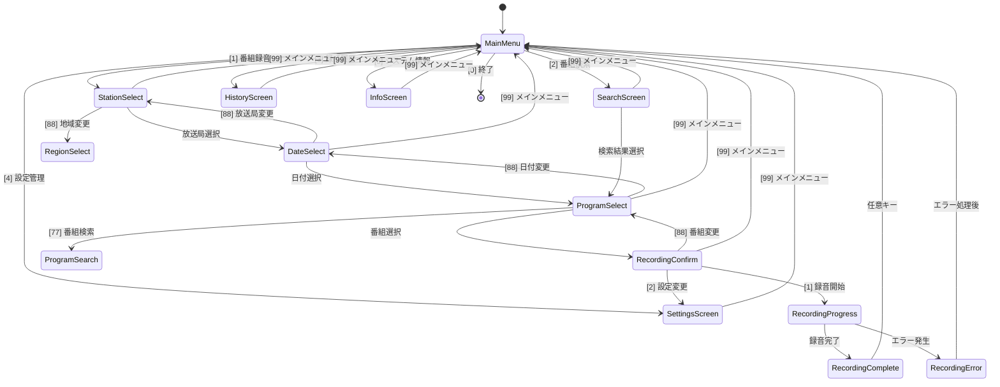

# RecRadiko対話型インターフェース 概要設計書
## バージョン 2.0 - メニュー駆動型UI アーキテクチャ

---

## 1. システム概要

### 1.1 設計目標
RecRadikoタイムフリー専用システムの対話型インターフェースを、従来のコマンド入力方式からメニュー駆動型UIに刷新し、ユーザビリティと保守性を向上させる。

### 1.2 アーキテクチャ方針
- **責任分離**: UI層・ビジネスロジック層・データアクセス層の明確な分離
- **状態管理**: Stateパターンによる画面遷移とセッション管理
- **拡張性**: 新メニュー項目・画面の追加容易性
- **テスト容易性**: Mock化可能なインターフェース設計

---

## 2. システムアーキテクチャ

### 2.1 レイヤー構成

```
┌─────────────────────────────────────────┐
│             Presentation Layer          │
├─────────────────────────────────────────┤
│ ┌─────────────┐ ┌─────────────────────┐ │
│ │ MenuManager │ │   Screen Classes    │ │
│ │             │ │ - MainMenuScreen    │ │
│ │ - run()     │ │ - StationScreen     │ │
│ │ - navigate()│ │ - DateScreen        │ │
│ │ - handle()  │ │ - ProgramScreen     │ │
│ └─────────────┘ └─────────────────────┘ │
├─────────────────────────────────────────┤
│            Business Logic Layer         │
├─────────────────────────────────────────┤
│ ┌─────────────┐ ┌─────────────────────┐ │
│ │ UIService   │ │   Existing Services │ │
│ │             │ │ - TimeFreeRecorder  │ │
│ │ - validate()│ │ - ProgramHistory    │ │
│ │ - format()  │ │ - AuthService       │ │
│ │ - filter()  │ │ - RegionMapper      │ │
│ └─────────────┘ └─────────────────────┘ │
├─────────────────────────────────────────┤
│              Data Access Layer          │
├─────────────────────────────────────────┤
│ ┌─────────────┐ ┌─────────────────────┐ │
│ │ UIState     │ │   Existing Data     │ │
│ │             │ │ - Config Files      │ │
│ │ - session   │ │ - SQLite Database   │ │
│ │ - selection │ │ - Cache Files       │ │
│ │ - history   │ │ - Log Files         │ │
│ └─────────────┘ └─────────────────────┘ │
└─────────────────────────────────────────┘
```

### 2.2 コンポーネント関係図

```
┌─────────────────────────────────────────────────────────┐
│                    RecRadikoCLI                         │
│                                                         │
│  ┌─────────────────────────────────────────────────┐    │
│  │              MenuManager                        │    │
│  │                                                 │    │
│  │  ┌──────────────┐    ┌──────────────────────┐   │    │
│  │  │ ScreenStack  │    │    InputValidator    │   │    │
│  │  │              │    │                      │   │    │
│  │  │ - push()     │    │ - validate_number()  │   │    │
│  │  │ - pop()      │    │ - validate_range()   │   │    │
│  │  │ - current()  │    │ - sanitize_input()   │   │    │
│  │  └──────────────┘    └──────────────────────┘   │    │
│  └─────────────────────────────────────────────────┘    │
│                           │                             │
│  ┌─────────────────────────────────────────────────┐    │
│  │              Screen Classes                     │    │
│  │                                                 │    │
│  │ ┌─────────────┐ ┌─────────────┐ ┌──────────────┐│    │
│  │ │MainMenu     │ │StationSelect│ │DateSelect    ││    │
│  │ │Screen       │ │Screen       │ │Screen        ││    │
│  │ │             │ │             │ │              ││    │
│  │ │- display()  │ │- load_data()│ │- generate()  ││    │
│  │ │- handle()   │ │- filter()   │ │- validate()  ││    │
│  │ └─────────────┘ └─────────────┘ └──────────────┘│    │
│  │                                                 │    │
│  │ ┌─────────────┐ ┌─────────────┐ ┌──────────────┐│    │
│  │ │ProgramSelect│ │SearchScreen │ │SettingsScreen││    │
│  │ │Screen       │ │             │ │              ││    │
│  │ │             │ │- search()   │ │- load_config│││    │
│  │ │- paginate() │ │- highlight()│ │- save_config││    │
│  │ │- confirm()  │ └─────────────┘ └──────────────┘│    │
│  │ └─────────────┘                                 │    │
│  └─────────────────────────────────────────────────┘    │
│                           │                             │
│  ┌─────────────────────────────────────────────────┐    │
│  │              UIService                          │    │
│  │                                                 │    │
│  │ ┌─────────────┐ ┌─────────────┐ ┌──────────────┐│    │
│  │ │DataFormatter│ │SessionManager│ │ProgressTracker│   │
│  │ │             │ │             │ │              ││    │
│  │ │- format_*() │ │- save_state()│ │- update()    ││    │
│  │ │- truncate() │ │- restore()  │ │- estimate()  ││    │
│  │ │- colorize() │ │- clear()    │ │- display()   ││    │
│  │ └─────────────┘ └─────────────┘ └──────────────┘│    │
│  └─────────────────────────────────────────────────┘    │
└─────────────────────────────────────────────────────────┘
```

---

## 3. モジュール設計

### 3.1 新規モジュール

#### 3.1.1 `src/ui/` パッケージ構成
```
src/ui/
├── __init__.py
├── menu_manager.py          # メニュー管理・画面遷移制御
├── screen_base.py           # 画面基底クラス
├── screens/
│   ├── __init__.py
│   ├── main_menu.py         # メインメニュー画面
│   ├── station_select.py    # 放送局選択画面
│   ├── date_select.py       # 日付選択画面
│   ├── program_select.py    # 番組選択画面
│   ├── search_screen.py     # 番組検索画面
│   ├── settings_screen.py   # 設定管理画面
│   └── info_screen.py       # システム情報画面
├── validators/
│   ├── __init__.py
│   └── input_validator.py   # 入力検証機能
├── formatters/
│   ├── __init__.py
│   ├── data_formatter.py    # データ表示フォーマット
│   └── progress_formatter.py # 進捗表示フォーマット
└── services/
    ├── __init__.py
    ├── ui_service.py        # UI専用ビジネスロジック
    └── session_manager.py   # セッション・状態管理
```

### 3.2 既存モジュール連携

#### 3.2.1 依存関係マップ
```
新規UIモジュール → 既存サービスモジュール

ui.menu_manager      → cli.RecRadikoCLI
ui.screens.*         → program_history.ProgramHistoryManager
ui.services.*        → timefree_recorder.TimeFreeRecorder
ui.validators.*      → auth.AuthService
ui.formatters.*      → region_mapper.RegionMapper
```

#### 3.2.2 インターフェース適応
- **既存CLI**: コマンドライン引数処理から対話型メニューに移行
- **既存サービス**: APIインターフェースを維持、UI層から呼び出し
- **設定管理**: 既存JSON設定ファイルシステムを継続使用

---

## 4. データフロー設計

### 4.1 番組録音フロー（メイン）



### 4.2 状態管理フロー



---

## 5. インターフェース設計

### 5.1 基底インターフェース

#### 5.1.1 Screen基底クラス
```python
from abc import ABC, abstractmethod
from typing import Dict, Any, Optional, Tuple

class ScreenBase(ABC):
    """画面基底クラス - 全画面共通インターフェース"""
    
    def __init__(self, session_manager: 'SessionManager'):
        self.session = session_manager
        self.title = ""
        self.options = []
        
    @abstractmethod
    def display(self) -> None:
        """画面表示処理"""
        pass
        
    @abstractmethod
    def handle_input(self, user_input: str) -> Tuple[str, Optional[Dict[str, Any]]]:
        """
        入力処理
        Returns:
            Tuple[next_screen_id, context_data]
        """
        pass
        
    @abstractmethod
    def validate_input(self, user_input: str) -> bool:
        """入力検証"""
        pass
        
    def get_common_options(self) -> Dict[str, str]:
        """共通選択肢 (戻る、終了等)"""
        return {
            "99": "メインメニューに戻る",
            "0": "終了"
        }
```

#### 5.1.2 MenuManager インターフェース
```python
from typing import Dict, Any, Optional
from .screen_base import ScreenBase

class MenuManager:
    """メニュー管理・画面遷移制御"""
    
    def __init__(self):
        self.screen_stack = []
        self.current_screen = None
        self.session_data = {}
        
    def register_screen(self, screen_id: str, screen_class: type) -> None:
        """画面クラス登録"""
        pass
        
    def navigate_to(self, screen_id: str, context: Optional[Dict[str, Any]] = None) -> None:
        """画面遷移"""
        pass
        
    def go_back(self) -> None:
        """前画面に戻る"""
        pass
        
    def run(self) -> int:
        """メインループ実行"""
        pass
```

### 5.2 データインターフェース

#### 5.2.1 セッションデータ構造
```python
from dataclasses import dataclass
from typing import List, Optional, Dict, Any
from datetime import datetime

@dataclass
class UserSelection:
    """ユーザー選択状態"""
    station_id: Optional[str] = None
    station_name: Optional[str] = None
    selected_date: Optional[str] = None
    selected_program: Optional[Dict[str, Any]] = None
    recording_settings: Optional[Dict[str, Any]] = None

@dataclass
class UISession:
    """UIセッション管理"""
    selection: UserSelection
    screen_history: List[str]
    start_time: datetime
    last_activity: datetime
    cached_data: Dict[str, Any]
```

#### 5.2.2 表示データ構造
```python
@dataclass
class MenuOption:
    """メニュー選択肢"""
    number: str
    label: str
    description: Optional[str] = None
    enabled: bool = True

@dataclass
class ScreenData:
    """画面表示データ"""
    title: str
    subtitle: Optional[str] = None
    options: List[MenuOption]
    footer_text: Optional[str] = None
    progress_info: Optional[Dict[str, Any]] = None
```

---

## 6. 非機能要件設計

### 6.1 パフォーマンス設計

#### 6.1.1 応答時間要件
- **画面遷移**: < 100ms (ローカル処理)
- **放送局リスト取得**: < 200ms (キャッシュ利用)
- **番組表取得**: < 3秒 (API呼び出し)
- **ユーザー入力応答**: < 50ms (入力検証)

#### 6.1.2 メモリ使用量
- **UIセッションデータ**: < 5MB
- **番組表キャッシュ**: < 50MB (7日分)
- **画面描画バッファ**: < 1MB

### 6.2 可用性設計

#### 6.2.1 エラー回復
- **API障害**: 自動リトライ → キャッシュデータ使用 → エラー画面
- **ネットワーク障害**: オフラインモード提供
- **入力エラー**: 即座フィードバック → 再入力促進

#### 6.2.2 セッション管理
- **自動保存**: 選択状態の3秒間隔保存
- **復旧機能**: 異常終了時の状態復元
- **タイムアウト**: 30分非操作でセッション初期化

### 6.3 拡張性設計

#### 6.3.1 新画面追加
- プラグイン的Screen追加: `register_screen()`
- 設定ファイルによる画面定義
- 動的メニュー生成機能

#### 6.3.2 国際化対応
- 文言外部化 (i18n)
- 地域別UI設定
- 多言語メニュー構造

---

## 7. セキュリティ設計

### 7.1 入力セキュリティ
- **入力検証**: 厳格な型・範囲チェック
- **SQLインジェクション対策**: パラメータ化クエリ
- **XSS対策**: 出力エスケープ処理

### 7.2 セッションセキュリティ
- **認証情報保護**: メモリ内のみ保持
- **セッション暗号化**: 一時ファイル暗号化
- **ログ保護**: 機密情報の非記録

---

## 8. 実装方針

### 8.1 開発アプローチ
- **段階的実装**: Phase 1-3の優先度別開発
- **テスト駆動開発**: 各Screen・ServiceのTDD
- **インクリメンタル移行**: 既存CLIとの並行実行

### 8.2 品質保証
- **単体テスト**: 各クラス90%+カバレッジ
- **統合テスト**: 画面遷移シナリオテスト
- **ユーザビリティテスト**: 実際操作による検証

### 8.3 マイグレーション戦略
- **段階的移行**: 機能毎の置き換え
- **後方互換性**: 既存CLI APIの保持
- **設定移行**: 既存設定ファイルの自動変換

---

## 9. 実装優先度・スケジュール

### 9.1 Phase 1: 基盤実装 (Week 1-2)
- **メニュー管理基盤**: MenuManager, ScreenBase
- **主要画面**: MainMenu, StationSelect, DateSelect, ProgramSelect
- **基本機能**: 3段階録音フロー

### 9.2 Phase 2: 機能拡張 (Week 3-4)
- **検索機能**: SearchScreen
- **設定管理**: SettingsScreen
- **エラーハンドリング**: 包括的エラー処理

### 9.3 Phase 3: 品質向上 (Week 5-6)
- **UI改善**: プログレス表示、アニメーション
- **システム情報**: InfoScreen
- **パフォーマンス最適化**: キャッシュ、レスポンス向上

---

**文書バージョン**: 1.0  
**作成日**: 2025-07-15  
**更新日**: 2025-07-15  
**承認**: システム設計チーム